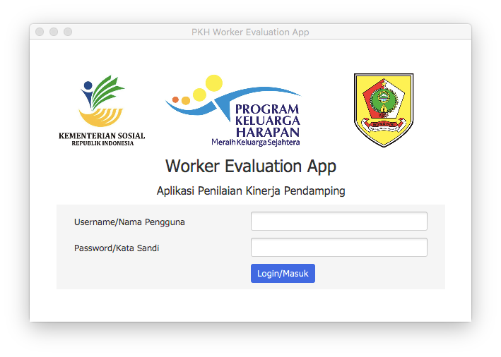
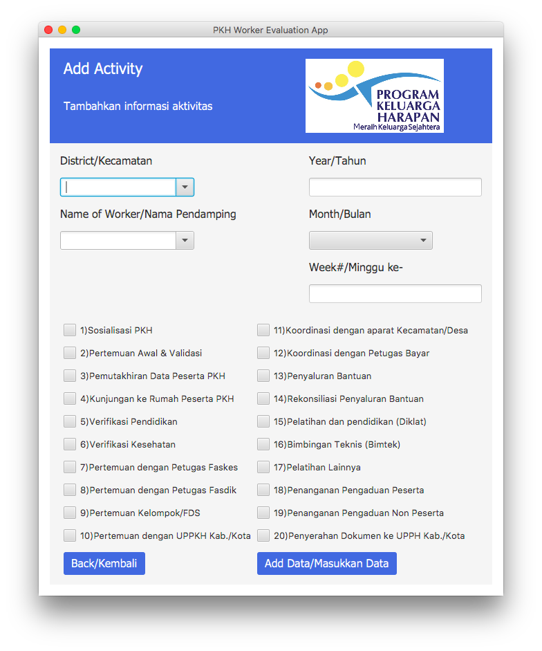
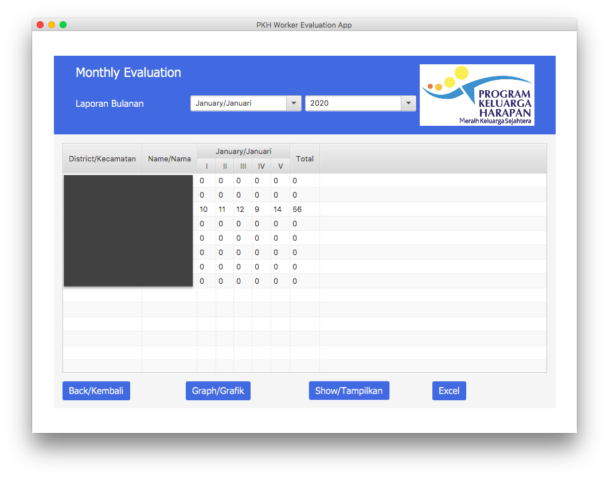
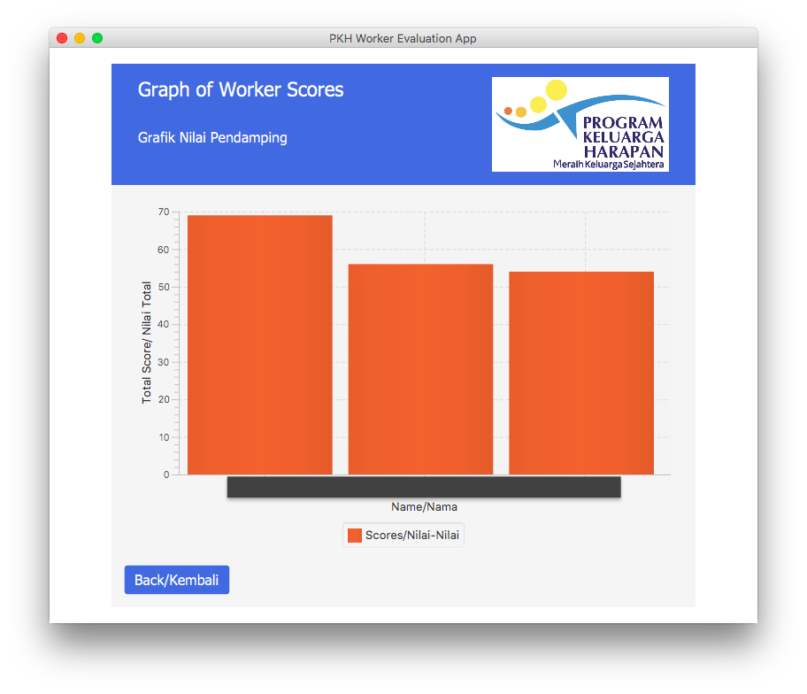

# PKH Database Application

This web application was developed during my time as a Software Developer for the Family of Hope Program (Program Keluarga Harapan; PKH) under the Social Welfare Ministry of Indonesia. This project involved the creation of a database system that allows workers from the Central Java branch of the organization to remotely store data and produces data visualizations for ease of analysis. I took leadership for this project as my role in this project was both to assess the organization's needs through interviewing key members of the organization and was the lead in creating the solution. Throughout this project, I coded the Application in Java whilst utilizing JavaFX, CSS, and XSSFSheet Library as main frameworks to build this Application.

## Feature overview

#### General features

- User login
- Inserting worker details
- Viewing worker productivity

#### Program flow

- Create new worker user profiles
- Input predetermined tasks they were able execute during the week
- View inputted data for all workers in table form or graph form
- Export data as a microsoft excel spreadsheet

## How to Input Worker Productivity

1. Access the Add Activity interface from the main menu
2. Insert the name and district of the worker
3. Insert the time in which the worker worked
4. Check the boxes in which the worker did the task of

## How to Access Worker Information

1. From the Main Menu, either access the Monthly or Yearly Evaluations
2. Choose the Month and Year or just Year in which to Evaluate productivity
3. A table should be displayed after pressing the Show button
4. You may export the data as an Excel file using the Excel button
5. You may see the bar graph visualization of Data by clicking the Graph button

## Screenshots

\*Note: Black boxes censor sensitive information such as full names, faces, and specific locations

### Login

### Inserting Worker Details

### Viewing Worker Productivity

#### Graph Form

#### Graph Form

## Tools and libraries

- XSSFSheet Library
